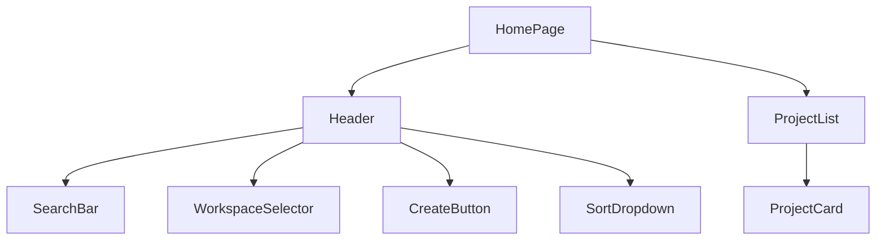

# Step 3: Home Page UI Implementation Design Plan

## Overview
This design plan outlines the implementation of the Home page UI based on the provided design mockup and requirements from `plans/03-home-page-ui.md`. The implementation will focus on creating a visually appealing and functional home page that displays project cards with placeholder data.

## Current State Analysis
- Basic HomePage component exists with placeholder sections
- Sidebar navigation is implemented with Home, Create new, and Projects links
- Project uses Tailwind CSS and shadcn/ui for styling

## Design Decisions

### 1. Component Structure


#### Components Breakdown:
1. **Header**: Top navigation and actions
   - SearchBar component with search icon
   - WorkspaceSelector with user avatar and project count
   - CreateButton (purple, with "+" icon)
   - SortDropdown ("Sort by: Date")

2. **ProjectList**: Vertical list of projects
   - Full-width container
   - Spacing between cards
   - "Total X videos" counter at top

3. **ProjectCard**: Individual project display
   - Thumbnail with play button and duration
   - Title as heading
   - Tags with different colors (Camera, Light, Streaming, etc.)
   - Author info with avatar
   - Posted time
   - Business template indicator with slide count
   - Action buttons (Edit, Download, Translate, Delete)

### 2. Mock Data Structure
```typescript
interface Project {
  id: string;
  title: string;
  thumbnail: string;
  duration: string;
  tags: Array<{
    name: string;
    color: string;
  }>;
  author: {
    name: string;
    avatar: string;
  };
  postedTime: string;
  template: {
    type: string;
    slideCount: number;
  };
}
```

### 3. Styling Approach
- Use Tailwind CSS for layout and styling
- shadcn/ui components for:
  - Buttons
  - Dropdowns
  - Search input
  - Cards
- Custom styling for:
  - Play button overlay on thumbnails
  - Tag colors
  - Action button hover states

## Implementation Tasks

1. **Create Mock Data**
   - Define TypeScript interfaces
   - Create sample projects with realistic data
   - Include varied thumbnails and tag combinations

2. **Implement Header Components**
   - SearchBar with icon and placeholder
   - WorkspaceSelector dropdown
   - Create new button
   - Sort dropdown

3. **Create ProjectCard Component**
   - Implement thumbnail with duration overlay
   - Add title and tags section
   - Add author info and timestamp
   - Add template info and slide count
   - Implement action buttons

4. **Build ProjectList Component**
   - Create list container
   - Add total count header
   - Map through projects to render cards
   - Add proper spacing

5. **Update HomePage Layout**
   - Implement main container
   - Add header section
   - Add projects list section
   - Ensure proper padding and margins

## Testing Strategy

### 1. Playwright Tests
```typescript
test('home page displays correctly', async ({ page }) => {
  await page.goto('/');
  
  // Check header elements
  await expect(page.getByPlaceholder('Search')).toBeVisible();
  await expect(page.getByText('Create new')).toBeVisible();
  await expect(page.getByText('Sort by:')).toBeVisible();
  
  // Check project list
  await expect(page.getByTestId('project-list')).toBeVisible();
  const projectCards = await page.getByTestId('project-card').all();
  expect(projectCards.length).toBeGreaterThan(0);
  
  // Check project card elements
  const firstCard = projectCards[0];
  await expect(firstCard.getByTestId('duration')).toBeVisible();
  await expect(firstCard.getByTestId('tags')).toBeVisible();
  await expect(firstCard.getByTestId('author')).toBeVisible();
  await expect(firstCard.getByTestId('actions')).toBeVisible();
});
```

### 2. Visual Testing
- Verify layout matches design mockup exactly
- Check responsive behavior
- Validate hover states and transitions
- Ensure consistent spacing

## Logging & Observability
- Add data-testid attributes for testing
- Log user interactions with action buttons
- Track search and sort usage

## Validation Plan
1. **Visual Verification**
   - Compare implementation with design mockup
   - Verify all components are pixel-perfect
   - Check spacing and alignment

2. **Functional Testing**
   - Verify all buttons are clickable
   - Test hover states
   - Validate sort dropdown
   - Check search input behavior

3. **Code Quality**
   - ESLint/Prettier compliance
   - TypeScript type coverage
   - Component organization
   - Proper use of Tailwind classes

## Dependencies
- Tailwind CSS
- shadcn/ui
- Lucide React icons

## Risks and Mitigations
1. **Risk**: Complex card layout might break on different screen sizes
   - **Mitigation**: Implement responsive breakpoints carefully

2. **Risk**: Performance impact from thumbnail images
   - **Mitigation**: Use proper image optimization

3. **Risk**: Inconsistent tag colors
   - **Mitigation**: Create a predefined color map for tags

## Future Considerations
1. Implement search functionality
2. Add sorting and filtering
3. Real API integration
4. Pagination for large lists

## Acceptance Criteria Checklist
- [ ] Header matches design mockup
- [ ] Project cards match design exactly
- [ ] All interactive elements work
- [ ] Proper spacing and alignment
- [ ] Responsive design implemented
- [ ] All tests pass
- [ ] No console errors
- [ ] Follows project guidelines

## Implementation Notes
- Focus on pixel-perfect implementation
- Use semantic HTML
- Ensure keyboard accessibility
- Maintain consistent spacing