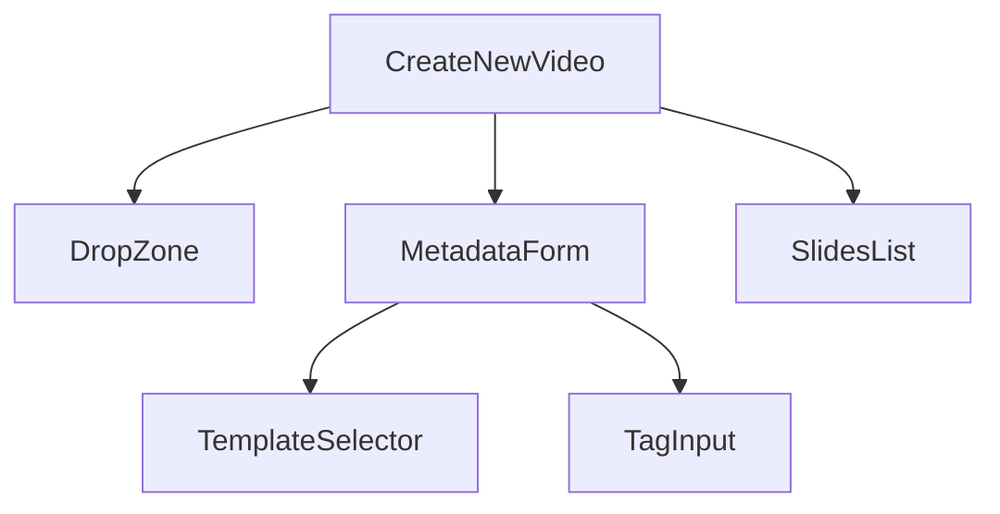
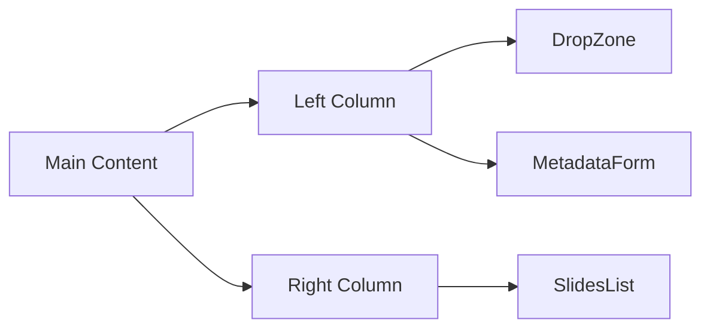

# Design Plan: Create New View Implementation

## Overview
This document outlines the detailed design plan for implementing the "Create New" view, which allows users to create new video projects by uploading PPT files and providing metadata.

## Design Decisions

### 1. Component Architecture


#### Rationale
- Using a component-based architecture following the project's frontend guidelines
- Each component has a single responsibility
- Reusable components (TemplateSelector, TagInput) can be used in other views
- Follows shadcn/ui and Tailwind CSS styling guidelines

### 2. Layout Structure


#### Rationale
- Two-column layout provides clear separation between input (left) and preview (right)
- Follows the same root layout structure as the home page for consistency
- Responsive design using Tailwind CSS grid/flex system

### 3. State Management
- Local state using React hooks for form data and file upload status
- No global state needed at this stage as per requirements
- Form validation using React Hook Form with Yup schema validation

### 4. Routing
- Route: `/create` for new projects
- Route: `/edit/:id` for editing existing projects
- Uses the same component with different initial states

## Implementation Tasks

### 1. Component Creation
1. Create base components:
   ```typescript
   // Components to create:
   - CreateNewVideo.tsx
   - DropZone.tsx
   - MetadataForm.tsx
   - SlidesList.tsx
   - TemplateSelector.tsx
   - TagInput.tsx
   ```

2. Implement layout structure:
   - Use Tailwind CSS grid for responsive two-column layout
   - Ensure consistent spacing and alignment with design system

### 2. Form Implementation
1. Set up form schema:
   ```typescript
   interface ProjectFormData {
     title: string;
     description?: string;
     template: string;
     tags: string[];
   }
   ```

2. Implement form validation:
   - Required fields: title, template
   - Optional fields: description, tags
   - File validation: PPT/PPTX only, max 50MB

### 3. File Upload UI
1. Implement drag-and-drop zone:
   - Visual feedback for drag events
   - File type validation
   - Size limit validation
   - Upload status indicators

### 4. Mock Slides Preview
1. Create static slide preview:
   - Placeholder slide items
   - Basic slide information display
   - Right column layout matching design

### 5. Navigation Integration
1. Update breadcrumb navigation
2. Implement route handling
3. Add navigation from home page

## Testing Strategy

### 1. Component Tests
```typescript
// Test cases to implement:
- CreateNewVideo renders correctly
- DropZone handles file drag/drop events
- MetadataForm validation works
- SlidesList displays mock data
```

### 2. E2E Tests (Playwright)
1. Navigation flow:
   - Click "Create new" → navigate to /create
   - Verify all components are visible

2. Form interaction:
   - Fill in metadata fields
   - Validate form submission
   - Test field validation

3. File upload:
   - Drag and drop file
   - Verify upload zone feedback
   - Test file type validation

4. Visual regression:
   - Capture screenshots for layout verification
   - Check responsive behavior
   - Verify component alignment

## Logging & Observability

### 1. User Interaction Logging
- Log form submissions
- Track file upload attempts
- Monitor validation errors

### 2. Error Handling
- Display toast notifications for errors
- Implement error boundaries
- Log client-side errors

## Implementation Sequence

1. **Setup Phase**
   - Create route configuration
   - Set up base component structure
   - Implement layout grid

2. **Core Components**
   - Implement DropZone
   - Create MetadataForm
   - Add mock SlidesList

3. **Integration**
   - Connect navigation
   - Implement breadcrumb updates
   - Add form validation

4. **Testing & Polish**
   - Write component tests
   - Implement E2E tests
   - Add error handling
   - Polish UI/UX details

## Validation Checklist

- [ ] Components follow project structure guidelines
- [ ] TypeScript types are properly defined
- [ ] Tailwind CSS classes follow design system
- [ ] Form validation is comprehensive
- [ ] Error handling is implemented
- [ ] Tests cover all main scenarios
- [ ] Responsive design works on all breakpoints
- [ ] Navigation flow is intuitive
- [ ] Loading states are handled
- [ ] Error states are handled
- [ ] Console is free of errors/warnings

## Next Steps

After implementation approval:
1. Switch to Boomerang Mode to coordinate implementation
2. Break down tasks into smaller subtasks following these instructions:
   - read the guidance in the docs folder, especially the "test-automation-guidelines.md" and "coding-guidelines.md" and "architecture.md" files.  Make sure to include the guidance in the context.
   - in the implementation/subtasks folder, create a new file that documents all the subtasks for the step.
   - each subtask should be a small, manageable piece of work that can be completed in a short time frame.
   - each subtask should have a clear acceptance criteria and testing requirements.
3. Execute tasks in sequence
4. Validate against acceptance criteria
5. Prepare for Step 5: Authentication Integration